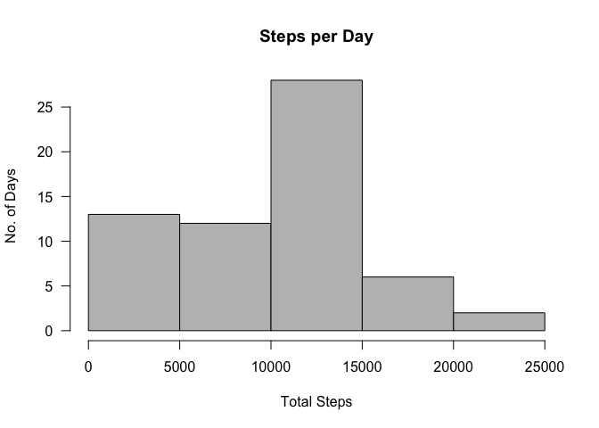
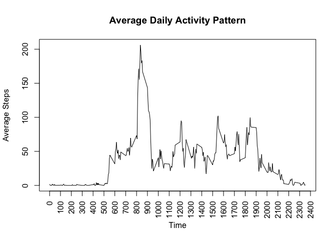
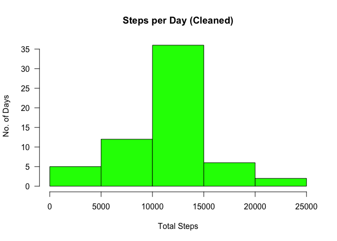
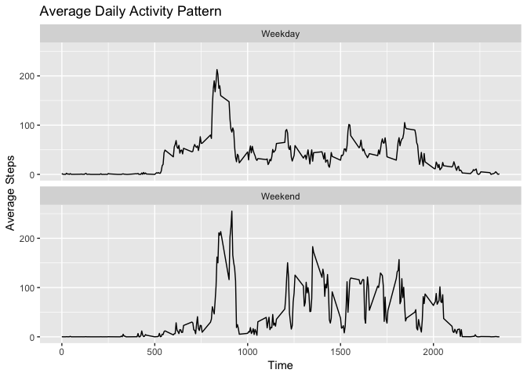

## Loading and preprocessing the data


```r
setwd("/Users/Chris/Documents/GitHub/RepData_PeerAssessment1")

# Load Packages
library(dplyr)
```

```
## 
## Attaching package: 'dplyr'
```

```
## The following objects are masked from 'package:stats':
## 
##     filter, lag
```

```
## The following objects are masked from 'package:base':
## 
##     intersect, setdiff, setequal, union
```

```r
library(ggplot2)

# download zip file containing data if it hasn't already been downloaded
zipUrl <- "https://d396qusza40orc.cloudfront.net/repdata%2Fdata%2Factivity.zip"
zipFile <- "activity.zip"
# zipFile will be unzipped to folder of same name less the .zip extension
dataDest <- gsub(".zip$", "", zipFile)

if (!file.exists(zipFile)) {
    download.file(zipUrl, zipFile, mode = "wb")
}

# unzip zip file containing data if data directory doesn't already exist
if (!file.exists(dataDest)) {
    unzip(zipFile)
}

# load data
activities <- read.csv("activity.csv")

# Create single Data Time Field
activities$intervalDateTime <-
    as.POSIXct(paste(activities$date, 
                     sprintf("%04d", activities$interval)),
               format("%Y-%m-%d %H %M"), 
               tz="")
```

## What is mean total number of steps taken per day?


```r
# Get total steps per day
dailySteps <- tapply(activities$steps,activities$date,sum, na.rm=TRUE)

# Get mean and median steps overall
meanSteps <- mean(dailySteps)
medianSteps <- median(dailySteps)

# Plot histogram
hist(dailySteps, 
     main="Steps per Day", 
     xlab="Total Steps", 
     ylab="No. of Days", 
     col="grey",
     las=1)
```

<!-- -->

The median daily steps is 10,395 and the mean 9,354.

## What is the average daily activity pattern?


```r
# Get Average (Mean) Steps for Each Interval, regardless of Day
intervals <- aggregate(
    steps ~ interval,
    data = activities,
    FUN = mean,
    na.rm = TRUE)

#Plot Time Series
plot.ts(x = intervals$interval,
     y = intervals$steps,
     type="l", 
     xlab = "Time",
     xaxt="n",                     # Remove x axis as adding our own
     ylab = "Average Steps",
     main="Average Daily Activity Pattern")
axis(1, 
     at = seq(0, 2400, by = 100),  # Side 1 (below axis)
     las=2)                        # Labels perpendicular to axis
```

<!-- -->

```r
# Find interval with max average no of steps
maxInterval<- intervals[which.max(intervals$steps),]
```

The 5-minute interval with the maximum number of steps is 835 with an average of 206 steps.

## Imputing missing values


```r
# Get total rows with NAs
rowsWithNAs <- sum(is.na(activities))
```

The total number of missing values in the dataset (i.e. the total number of rows with NAs) is 2,304


```r
# Replace NAs with average for the given interval
activitiesCleaned <- activities %>%
    group_by(interval) %>%
    mutate(steps = ifelse(is.na(steps),
        mean(steps, na.rm = TRUE),
        steps))

# Get total steps per day
dailyStepsCleaned <- tapply(activitiesCleaned$steps,activitiesCleaned$date,sum, na.rm=TRUE)

# Get mean and median steps overall
meanStepsCleaned <- mean(dailyStepsCleaned)
medianStepsCleaned <- median(dailyStepsCleaned)

# Plot histogram
hist(dailyStepsCleaned, 
     main="Steps per Day (Cleaned)", 
     xlab="Total Steps", 
     ylab="No. of Days", 
     col="green",
     las=1)
```

<!-- -->

When the data is cleaned of NAs, the median daily steps is 10,766 and the mean 10,766.

This compares to a median daily steps of 10,395 and mean of 9,354 for the raw data.  The effect is to increase the number of steps and spread them more evenly across the days.

## Are there differences in activity patterns between weekdays and weekends?


```r
# Find Weekends
activitiesCleaned <- activitiesCleaned %>%
    mutate(weekday = weekdays(intervalDateTime)) %>%
    mutate(dayType = as.factor(
        ifelse(weekday == "Saturday" | weekday == "Saturday",
            "Weekend",
            "Weekday")))

# Get mean steps by Day Type and Interval
intervalsCleanedByDayType <- activitiesCleaned %>%
    group_by(dayType, interval) %>%
    summarise(meanSteps = mean(steps))

# Plot panel line chart by Weekday / Weekend                               
ggplot(intervalsCleanedByDayType,
       aes(x = interval, 
           y = meanSteps)) +
    geom_line() +
    labs(x = "Time", 
         y = "Average Steps",
         title = "Average Daily Activity Pattern") +
    facet_wrap(~ dayType, ncol = 1)
```

<!-- -->
